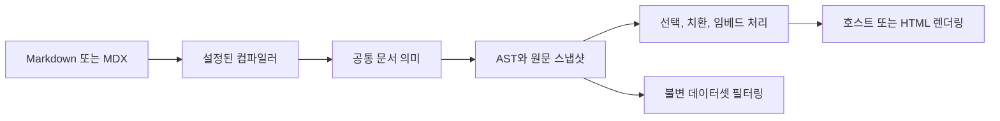

# API 레퍼런스

[English](./README.md) | **한국어** · [사용 가이드](../README.ko.md)

현재 구현의 공개 import, 옵션 기본값, 데이터 계약, 부수 효과, 내부 처리 방식을 설명합니다. 문서 작성과 어댑터 설치는 사용 가이드에서 시작하세요.

## 레퍼런스 구성

| 문서                         | 내용                                                    |
| ---------------------------- | ------------------------------------------------------- |
| [문서 API](./document.ko.md) | 문법 옵션, 컴파일, 의미 AST, 렌더링, 섹션, 필터링       |
| [Node API](./node.ko.md)     | 수집, 라이브러리 파일, 임베드, 데이터셋, 출력 보호, CLI |
| [어댑터](./adapters.ko.md)   | remark, 캡처, 호스트 순서, markdown-it 토큰, HTML 생성  |

## 패키지

호스트에 필요한 것만 설치하십시오. ESM이며 Node.js 20 이상이 필요합니다. 각 [사용 가이드](../README.ko.md)의 첫 단계에 그 호스트의 정확한 설치 명령이 있습니다.

| 패키지                                                            | 역할                                         |
| ----------------------------------------------------------------- | -------------------------------------------- |
| [`@cudoment/cudoc`](../../packages/cudoc/README.md)               | 공통 문서 처리, 컴파일, 쿼리, 수집, 데이터셋 |
| [`cudoc-remark`](../../packages/cudoc-remark/README.md)           | remark와 MDX 파이프라인 연결                 |
| [`cudoc-docusaurus`](../../packages/cudoc-docusaurus/README.md)   | Docusaurus 통합                              |
| [`cudoc-nextra`](../../packages/cudoc-nextra/README.md)           | Nextra 통합                                  |
| [`cudoc-markdown-it`](../../packages/cudoc-markdown-it/README.md) | markdown-it 파이프라인 연결                  |
| [`cudoc-vitepress`](../../packages/cudoc-vitepress/README.md)     | VitePress 렌더링과 수집                      |
| [`cudoc-eleventy`](../../packages/cudoc-eleventy/README.md)       | Eleventy 렌더링과 수집                       |
| [`cudoc-html`](../../packages/cudoc-html/README.md)               | 독립 HTML 생성                               |

Next.js에는 전용 어댑터 패키지가 없습니다. `@next/mdx`가 remark 파이프라인을 그대로 넘겨주고, cudoc이 순서를 맞춰야 할 네이티브 제목 ID 처리나 목차 처리도 없기 때문에, `host: "next"`를 준 `cudoc-remark` 하나가 통합의 전부입니다. Docusaurus와 Nextra에 어댑터가 있는 이유는 그 호스트들에 그런 처리가 있기 때문입니다. → [MDX 호스트](./adapters.ko.md#docusaurus와-nextra)

코어 패키지만 스코프를 사용합니다. npm에 `cudoc` 이름이 이미 있어서 `@cudoment/cudoc`으로 배포합니다.

## 패키지 경계

- `@cudoment/cudoc`은 문서 의미와 재사용 가능한 AST 연산을 소유합니다. Node API는 명시적인 `node/*` 진입점에 둡니다.
- `cudoc-remark`는 remark·MDX 파이프라인을 연결하고 준비된 임베드를 삽입합니다.
- `cudoc-docusaurus`, `cudoc-nextra`는 remark 순서와 호스트 제목 처리를 구성합니다.
- `cudoc-markdown-it`은 실제 Markdown-it 파이프라인을 연결하고, `cudoc-vitepress`와 `cudoc-eleventy`는 각각 호스트 정의 하나를 추가합니다.
- `cudoc-html`은 Markdown을 직접 수집하거나 호스트의 라이브러리·준비된 임베드를 재사용해 독립 HTML을 생성합니다. 출력 하이퍼링크는 로컬 연결·호스트 배포 URL 연결·제거 중에서 선택합니다.

코어에는 React 런타임 의존성이 없습니다. React는 MDX 임베드 런타임에서 사용합니다. Node 전용 진입점은 빌드 스크립트나 서버 코드에서 가져오고 클라이언트 컴포넌트에서는 가져오지 않습니다.

## 공개 진입점

전체 패키지 이름을 적은 경우 외에는 `@cudoment/cudoc` 뒤에 붙는 경로입니다. 실제 import 경계는 [패키지 exports](../../packages/cudoc/package.json)를 기준으로 합니다.

| Import                                                             | 역할                                            | 레퍼런스                                                      |
| ------------------------------------------------------------------ | ----------------------------------------------- | ------------------------------------------------------------- |
| `@cudoment/cudoc`, `/ast`, `/syntax`, `/mdx`                       | AST 검증, 순회, 선택자, 하위 노드 생성          | [코어 도우미](./document.ko.md#코어-도우미)                   |
| `/document`                                                        | 옵션과 원본 트리 정규화                         | [문서 모델](./document.ko.md#문서-옵션)                       |
| `/markdown`                                                        | 독립 컴파일                                     | [컴파일](./document.ko.md#컴파일)                             |
| `/render`                                                          | HAST와 HTML 렌더링                              | [렌더링](./document.ko.md#컴포넌트와-렌더링)                  |
| `/query`, `/sections`                                              | 섹션 선택과 쿼리                                | [섹션](./document.ko.md#섹션과-쿼리)                          |
| `/dataset`                                                         | 불변 필터링                                     | [필터링](./document.ko.md#필터링)                             |
| `/node/library`                                                    | 전체 라이브러리 수집과 로딩                     | [수집](./node.ko.md#수집)                                     |
| `/node/resolve-embed`                                              | 임베드 요청 해석과 처리                         | [임베드](./node.ko.md#임베드)                                 |
| `/node/prepare-embeds`                                             | 빌드 전 임베드 데이터 준비·읽기                 | [준비](./node.ko.md#준비된-임베드)                            |
| `/node/dataset`                                                    | 필터링한 AST 디렉터리 생성                      | [데이터셋](./node.ko.md#데이터셋)                             |
| `/node/check`, `/node/report`                                      | 라이브러리 전체 참조 검사와 출력 서식           | [참조 검사](./node.ko.md#참조-검사)                           |
| `/node/storage`                                                    | 파일시스템과 임시 디렉터리 기반 출력            | [저장](./node.ko.md#저장)                                     |
| `/embed`, `/node/export-ast`, `/node/load-ast-file`, `/node/paths` | 개별 AST 스냅샷과 경로                          | [개별 스냅샷](./node.ko.md#개별-ast-스냅샷)                   |
| `/transforms/*`                                                    | 하위 문법 변환                                  | [코어 도우미](./document.ko.md#코어-도우미)                   |
| `/styles.css`                                                      | 테마를 인식하는 알림과 배지 스타일              | [호스트 스타일시트](./document.ko.md#호스트-스타일시트)       |
| `cudoc-remark`와 하위 경로                                         | remark 연동, 캡처, TOC, 임베드 런타임           | [remark](./adapters.ko.md#remark)                             |
| `cudoc-docusaurus`, `cudoc-nextra`                                 | 호스트 플러그인 배열                            | [MDX 호스트](./adapters.ko.md#docusaurus와-nextra)            |
| `cudoc-markdown-it`                                                | 호스트 어댑터가 공유하는 markdown-it 파이프라인 | [markdown-it](./adapters.ko.md#markdown-it)                   |
| `cudoc-vitepress`                                                  | VitePress 호스트 정의와 컴파일러                | [VitePress와 Eleventy](./adapters.ko.md#vitepress와-eleventy) |
| `cudoc-eleventy`                                                   | Eleventy 호스트 정의, 렌더러와 컴파일러         | [VitePress와 Eleventy](./adapters.ko.md#vitepress와-eleventy) |
| `cudoc-html`                                                       | 사이트 생성기와 기본 CSS                        | [HTML](./adapters.ko.md#html)                                 |

`/embed`는 개별 스냅샷을 위한 Node 모음입니다. 문서 라이브러리나 코드 블록 임베드 API를 재수출하지 않습니다. 해당 API는 표에 적힌 `node/*`에서 가져옵니다. `/sections`는 `collectSections`를 제공하며 `/query`에는 하위 조회 도우미도 포함됩니다.

## 처리 흐름

문법 확장만 렌더링할 때는 라이브러리 저장이 필요하지 않습니다. 문서 간 임베드는 저장된 라이브러리를 사용하며, 원문 치환은 기존 설정으로 다시 컴파일합니다. 호스트 어댑터는 독립 파서와 결과가 같다고 가정하지 않고 실제 호스트 처리를 캡처해야 합니다.

같은 수집 라이브러리를 기본 호스트와 독립 HTML에서 함께 사용할 수 있습니다. HTML의 `library` 모드는 호스트 컴파일러를 다시 실행하거나 공유 파일을 변경하지 않고 준비된 블록을 사용합니다. [HTML 입력 경로와 링크 정책](./adapters.ko.md#html)을 참고하세요.

## 최신화

함수, export, 옵션, 기본값, 스키마, 진단, 파이프라인을 변경할 때 같은 변경에서 관련 레퍼런스를 갱신합니다. 호출자의 사용 흐름이 바뀌면 사용 가이드와 실행 예제도 확인합니다.
