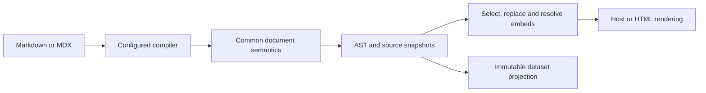

# API reference

**English** | [한국어](./README.ko.md) · [Usage guides](../README.md)

This reference describes the current implementation: public imports, option defaults, data contracts, side effects and internal processing. For authoring documents and installing adapters, start with the usage guides.

## Reference pages

| Page                           | Contents                                                                      |
| ------------------------------ | ----------------------------------------------------------------------------- |
| [Document APIs](./document.md) | Syntax options, compilation, semantic AST, rendering, sections and projection |
| [Node APIs](./node.md)         | Collection, library files, embedding, datasets, output safety and CLI         |
| [Adapters](./adapters.md)      | remark, capture, host ordering, VitePress tokens and HTML generation          |

## Package boundaries

- `@cudoment/cudoc` owns document semantics and reusable AST operations. Node APIs live in explicit `node/*` entry points.
- `cudoc-remark` connects a remark/MDX pipeline and inserts prepared embeds.
- `cudoc-docusaurus` and `cudoc-nextra` configure remark ordering and native headings.
- `cudoc-vitepress` connects the actual Markdown-it pipeline.
- `cudoc-html` generates standalone HTML, either collecting Markdown itself or reusing a host's library and prepared embeds. Exported hyperlinks can be local, deployed-host URLs or removed.

The core has no React runtime dependency. React is used by the MDX embedding runtime. Import Node-only entry points from build scripts or server code, not client components.

## Public entry points

Prefixes below are relative to `@cudoment/cudoc` unless a full package name is shown. The [package exports](../../packages/cudoc/package.json) are the authoritative import boundary.

| Import                                                             | Purpose                                                         | Reference                                                  |
| ------------------------------------------------------------------ | --------------------------------------------------------------- | ---------------------------------------------------------- |
| `@cudoment/cudoc`, `/ast`, `/syntax`, `/mdx`                       | AST validation, traversal, selectors and low-level construction | [Core helpers](./document.md#core-helpers)                 |
| `/document`                                                        | Options and in-place normalization                              | [Document model](./document.md#document-options)           |
| `/markdown`                                                        | Standalone compilation                                          | [Compilation](./document.md#compilation)                   |
| `/render`                                                          | HAST and HTML rendering                                         | [Rendering](./document.md#components-and-rendering)        |
| `/query`, `/sections`                                              | Section selection and query helpers                             | [Sections](./document.md#sections-and-queries)             |
| `/dataset`                                                         | Immutable projection                                            | [Projection](./document.md#projection)                     |
| `/node/library`                                                    | Collect and load complete libraries                             | [Collection](./node.md#collection)                         |
| `/node/resolve-embed`                                              | Parse and resolve embed requests                                | [Embedding](./node.md#embedding)                           |
| `/node/prepare-embeds`                                             | Prepare/read build-time embed data                              | [Preparation](./node.md#prepared-embeds)                   |
| `/node/dataset`                                                    | Generate filtered AST directories                               | [Datasets](./node.md#datasets)                             |
| `/node/storage`                                                    | Filesystem and staged output helpers                            | [Storage](./node.md#storage)                               |
| `/embed`, `/node/export-ast`, `/node/load-ast-file`, `/node/paths` | Individual AST snapshots and path helpers                       | [Individual snapshots](./node.md#individual-ast-snapshots) |
| `/transforms/*`                                                    | Low-level syntax transforms                                     | [Core helpers](./document.md#core-helpers)                 |
| `/styles.css`                                                      | Callout and badge stylesheet                                    | [Stylesheet source](../../packages/cudoc/styles.css)       |
| `cudoc-remark` and its subpaths                                    | remark integration, capture, TOC and embed runtime              | [remark](./adapters.md#remark)                             |
| `cudoc-docusaurus`, `cudoc-nextra`                                 | Host plugin arrays                                              | [MDX hosts](./adapters.md#docusaurus-and-nextra)           |
| `cudoc-vitepress`                                                  | Markdown-it adapter and compiler                                | [VitePress](./adapters.md#vitepress)                       |
| `cudoc-html`                                                       | Site builder and base CSS                                       | [HTML](./adapters.md#html)                                 |

`/embed` is an individual-snapshot Node barrel. It does **not** re-export the document-library or fenced-embed APIs. Import those from their listed `node/*` paths. `/sections` exports `collectSections`; `/query` also includes the lower-level lookup helpers.

## Processing flow

Syntax-only rendering does not need library storage. Cross-document embedding uses the persisted library; source replacement recompiles original source with the original configuration. Host adapters must capture actual host processing rather than assume the standalone parser produces an identical result.

The same collected library can feed both the primary host and standalone HTML. HTML's `library` mode consumes prepared blocks without rerunning the host compiler or changing the shared files. See [HTML input paths and link policies](./adapters.md#html).

## Maintenance

Update the relevant reference page in the same change as a function, export, option, default, schema, diagnostic or pipeline change. Check the usage guides and runnable examples whenever a caller's workflow changes.
