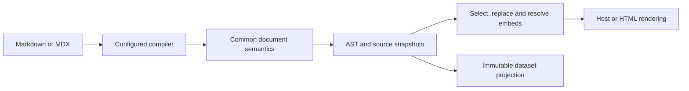

# API reference

**English** | [한국어](./README.ko.md) · [Usage guides](../README.md)

This reference describes the current implementation: public imports, option defaults, data contracts, side effects and internal processing. For authoring documents and installing adapters, start with the usage guides.

## Reference pages

| Page                           | Contents                                                                      |
| ------------------------------ | ----------------------------------------------------------------------------- |
| [Document APIs](./document.md) | Syntax options, compilation, semantic AST, rendering, sections and projection |
| [Node APIs](./node.md)         | Collection, library files, embedding, datasets, output safety and CLI         |
| [Adapters](./adapters.md)      | remark, capture, host ordering, markdown-it tokens and HTML generation        |

## Packages

Install only what your host needs. ESM, Node.js 20+. Each [usage guide](../README.md) opens with the exact install line for its host.

| Package                                                           | Purpose                                                                   |
| ----------------------------------------------------------------- | ------------------------------------------------------------------------- |
| [`@cudoment/cudoc`](../../packages/cudoc/README.md)               | Shared document processing, compilation, queries, collection and datasets |
| [`cudoc-remark`](../../packages/cudoc-remark/README.md)           | Connect remark and MDX pipelines                                          |
| [`cudoc-docusaurus`](../../packages/cudoc-docusaurus/README.md)   | Docusaurus integration                                                    |
| [`cudoc-nextra`](../../packages/cudoc-nextra/README.md)           | Nextra integration                                                        |
| [`cudoc-markdown-it`](../../packages/cudoc-markdown-it/README.md) | Connect markdown-it pipelines                                             |
| [`cudoc-vitepress`](../../packages/cudoc-vitepress/README.md)     | VitePress rendering and collection                                        |
| [`cudoc-eleventy`](../../packages/cudoc-eleventy/README.md)       | Eleventy rendering and collection                                         |
| [`cudoc-export`](../../packages/cudoc-export/README.md)           | Standalone HTML, PDF and Word generation                                  |

Next.js needs no adapter package of its own. `@next/mdx` hands over the remark pipeline directly, and there is no native heading-id or table-of-contents pass to order cudoc against, so `cudoc-remark` with `host: "next"` is the whole integration. The Docusaurus and Nextra adapters exist because those hosts do have such a pass. → [MDX hosts](./adapters.md#docusaurus-and-nextra)

Only the core package is scoped: `cudoc` was already taken on npm, so it publishes as `@cudoment/cudoc`.

## Package boundaries

- `@cudoment/cudoc` owns document semantics and reusable AST operations. Node APIs live in explicit `node/*` entry points.
- `cudoc-remark` connects a remark/MDX pipeline and inserts prepared embeds.
- `cudoc-docusaurus` and `cudoc-nextra` configure remark ordering and native headings.
- `cudoc-markdown-it` connects the actual Markdown-it pipeline; `cudoc-vitepress` and `cudoc-eleventy` add one host definition each.
- `cudoc-export` generates standalone HTML, PDF and Word, either collecting Markdown itself or reusing a host's library and prepared embeds. Every format reads one set of design tokens. Exported hyperlinks can be local, deployed-host URLs or removed.

The core has no React runtime dependency. React is used by the MDX embedding runtime. Import Node-only entry points from build scripts or server code, not client components.

## Public entry points

Prefixes below are relative to `@cudoment/cudoc` unless a full package name is shown. The [package exports](../../packages/cudoc/package.json) are the authoritative import boundary.

| Import                                                             | Purpose                                                         | Reference                                                      |
| ------------------------------------------------------------------ | --------------------------------------------------------------- | -------------------------------------------------------------- |
| `@cudoment/cudoc`, `/ast`, `/syntax`, `/mdx`                       | AST validation, traversal, selectors and low-level construction | [Core helpers](./document.md#core-helpers)                     |
| `/document`                                                        | Options and in-place normalization                              | [Document model](./document.md#document-options)               |
| `/markdown`                                                        | Standalone compilation                                          | [Compilation](./document.md#compilation)                       |
| `/render`                                                          | HAST and HTML rendering                                         | [Rendering](./document.md#components-and-rendering)            |
| `/query`, `/sections`                                              | Section selection and query helpers                             | [Sections](./document.md#sections-and-queries)                 |
| `/dataset`                                                         | Immutable projection                                            | [Projection](./document.md#projection)                         |
| `/node/library`                                                    | Collect and load complete libraries                             | [Collection](./node.md#collection)                             |
| `/node/resolve-embed`                                              | Parse and resolve embed requests                                | [Embedding](./node.md#embedding)                               |
| `/node/prepare-embeds`                                             | Prepare/read build-time embed data                              | [Preparation](./node.md#prepared-embeds)                       |
| `/node/watch`                                                      | Repeated, incremental collection                                | [Watching](./node.md#watching)                                 |
| `/node/dataset`                                                    | Generate filtered AST directories                               | [Datasets](./node.md#datasets)                                 |
| `/node/check`, `/node/report`                                      | Whole-library reference checking and its rendering              | [Reference checking](./node.md#reference-checking)             |
| `/node/storage`                                                    | Filesystem and staged output helpers                            | [Storage](./node.md#storage)                                   |
| `/embed`, `/node/export-ast`, `/node/load-ast-file`, `/node/paths` | Individual AST snapshots and path helpers                       | [Individual snapshots](./node.md#individual-ast-snapshots)     |
| `/transforms/*`                                                    | Low-level syntax transforms                                     | [Core helpers](./document.md#core-helpers)                     |
| `/styles.css`                                                      | Theme-aware callout and badge stylesheet                        | [Host stylesheet](./document.md#host-stylesheet)               |
| `/paged`                                                           | Page-break constants the paginated writers share                | [Paginated output](./adapters.md#paginated-output)             |
| `cudoc-remark` and its subpaths                                    | remark integration, capture, TOC and embed runtime              | [remark](./adapters.md#remark)                                 |
| `cudoc-docusaurus`, `cudoc-nextra`                                 | Host plugin arrays                                              | [MDX hosts](./adapters.md#docusaurus-and-nextra)               |
| `cudoc-markdown-it`                                                | Shared markdown-it pipeline for host adapters                   | [markdown-it](./adapters.md#markdown-it)                       |
| `cudoc-vitepress`                                                  | VitePress host definition and compiler                          | [VitePress and Eleventy](./adapters.md#vitepress-and-eleventy) |
| `cudoc-eleventy`                                                   | Eleventy host definition, renderer and compiler                 | [VitePress and Eleventy](./adapters.md#vitepress-and-eleventy) |
| `cudoc-export`                                                     | Site, PDF and Word builders, and the design tokens              | [Export](./adapters.md#export)                                 |
| `cudoc-export/docx`, `/pdf`, `/print`                              | The Word writer, the PDF printer and the print-ready HTML       | [Paginated output](./adapters.md#paginated-output)             |

`/embed` is an individual-snapshot Node barrel. It does **not** re-export the document-library or fenced-embed APIs. Import those from their listed `node/*` paths. `/sections` exports `collectSections`; `/query` also includes the lower-level lookup helpers.

## Processing flow

Syntax-only rendering does not need library storage. Cross-document embedding uses the persisted library; source replacement recompiles original source with the original configuration. Host adapters must capture actual host processing rather than assume the standalone parser produces an identical result.

The same collected library can feed both the primary host and standalone HTML. HTML's `library` mode consumes prepared blocks without rerunning the host compiler or changing the shared files. See [Export input paths and link policies](./adapters.md#export).

## Maintenance

Update the relevant reference page in the same change as a function, export, option, default, schema, diagnostic or pipeline change. Check the usage guides and runnable examples whenever a caller's workflow changes.
