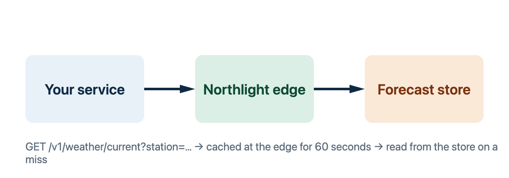

# Getting started (#getting-started)

Three steps take you from nothing to a first forecast. The whole flow is one
HTTPS request with a key in a header; there is no SDK to install.



## Get a key (#key)

Keys are issued per project and scoped to the stations a project may read.

##### Requirements (#requirements)

| Step     | Prerequisites                                                                                                     |
| -------- | ----------------------------------------------------------------------------------------------------------------- |
| Register | - A project name<br />- A billing contact<br />- At least one station<br />- Accepted terms<br />- A callback URL |
| Rotate   | - The current key<br />- Owner role                                                                               |

> [!IMPORTANT] Keep the key out of the browser
> A key grants every scope its project holds. Call Northlight from your own
> backend and pass results on; never ship the key in client-side code.

## Make a request (#request) (@New)

Send the key in the `Authorization` header and ask for a station by its code:

```sh
curl -H "Authorization: Bearer $NORTHLIGHT_KEY" \
  "https://api.northlight.example/v1/weather/current?station=OSL-01"
```

```json
{
  "station": "OSL-01",
  "observedAt": "2026-09-22T06:00:00Z",
  "temperatureC": 11.4,
  "windMs": 3.2,
  "conditions": "overcast"
}
```

Every response carries `observedAt`, the instant the station reported[^utc]. A
missing station returns `404` with a machine-readable `code`, listed under
[Error codes](reference/errors.md#errors).

## Stay within the limits (#limits)

Current conditions are cached at the edge for sixty seconds, so polling faster
than that returns the same reading and spends your quota. The windows and the
headers that report them are in [Rate limits](reference/limits.md#windows);
the short version is below.

```cudoc-embed
sources: [reference/limits.md#windows]
select:
  includeChildren: false
replace:
  - { find: "Every plan shares", replace: "As a new integrator you share" }
```

> [!WARNING] Bursts are counted per key
> Two services sharing one key share one window. Give each service its own key
> so a spike in one cannot starve the other.

[^utc]:
    Always UTC, always with a `Z` suffix. Convert at the edge of your own
    system, not in the data layer.
